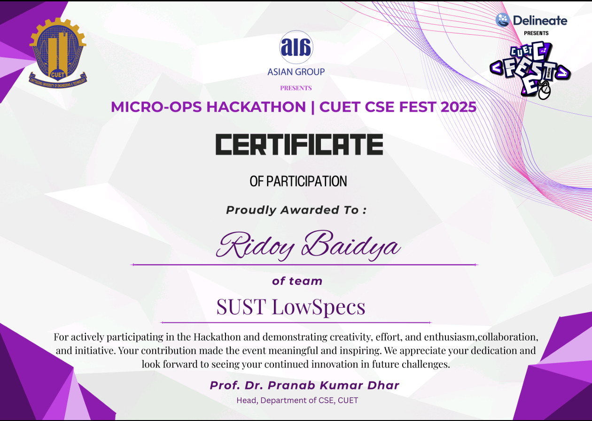
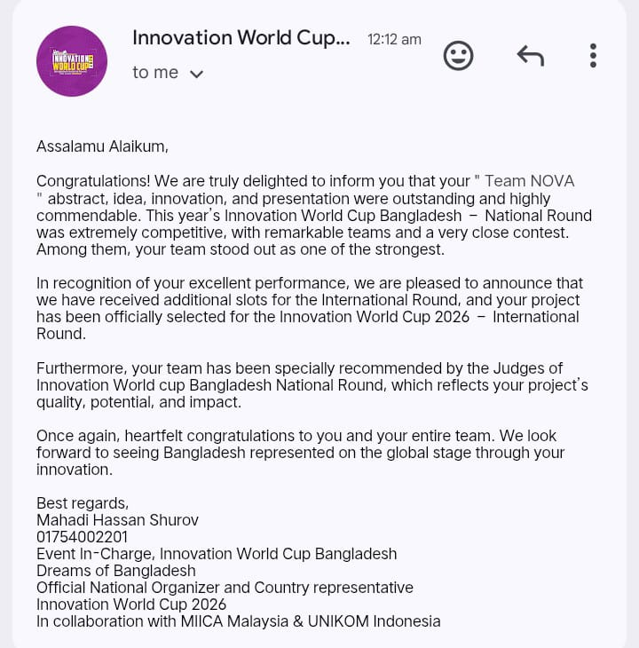

<!-- Premium Animated GitHub Profile for Ridoy Baidya -->

<!-- Banner -->

  

<h1 align="center">Hi 👋, I'm Ridoy Baidya</h1>

  

---

## 🚀 About Me

- 🎓 **CSE 5th Semester Student** at **Shahjalal University of Science & Technology (SUST)**
- 💻 Focused on **Software Engineering, DevOps, and Full-Stack Development**
- 🧠 Learning **Advanced DSA, Number Theory & Probability**
- 🌌 Interested in **Computational Astrophysics**
- 🤝 Open to collaboration on **DevOps, Web, App & AI/ML projects**
- 🚀 Passionate about building **scalable, automated, production-ready systems**

---

## 🛠️ Tech Stack

### 💻 Programming Languages
`C++` `Python` `JavaScript` `Dart`

### ⚙️ Frameworks & Platforms
`Flutter` `React` `Node.js` `Express`  
`Firebase` `MongoDB`

### 🚀 DevOps & Tools
`Docker` `Docker Compose`  
`GitHub Actions (CI/CD)`  
`Linux` `Nginx`  
`Grafana`  
`Virtual Machines (VM)`  
`S3-Compatible Storage (RustFS)`

---

## 🏆 Achievements

### 🚀 CUET Micro-Ops Hackathon – CUET CSE Fest 2025  
**Role:** Team Leader  
**Team:** SUST LowSpecs  

  

Led a team to design, deploy, and operate a **production-like DevOps system** under real-world operational constraints during a competitive hackathon.

#### 🔧 Key Contributions & Technologies
- 🖥️ **Production deployment on Linux-based Virtual Machine (VM)**
- 📦 **Docker & Docker Compose** for containerized microservices
- ☁️ **S3-compatible storage using RustFS** to minimize download latency
- 🔄 **CI/CD pipeline with GitHub Actions** for automated build & deployment
- 📊 **Monitoring and observability using Grafana**
- 🌐 **Nginx** for service routing and management

#### 📈 Impact & Learnings
- Strengthened hands-on expertise in **DevOps workflows, automation, and system reliability**
- Applied **micro-operations and cloud-native concepts** in a time-constrained environment
- Gained real-world experience in **technical leadership, architecture planning, and team coordination**

---

### 🌎 Innovation World Cup 2026 – International Round Selection  
**Role:** Team Leader  
**Project:** AgriNova  
**Team:** Team Nova  

  

Selected for the **Innovation World Cup 2026 International Round** for developing **AgriNova**, an innovative solution aimed at transforming modern agriculture using technology.

#### 🔧 Key Highlights
- 🌱 Developed **AgriNova**, focusing on smart agriculture solutions
- 🤝 Represented **Team Nova** on an international stage
- 🏅 Recognized for **innovation, impact, and technical excellence**

---

## 📜 Certificates & Recognition

  
  

  <b>Left:</b> Micro-Ops Hackathon – CUET CSE Fest 2025 
  <b>Right:</b> Innovation World Cup 2026 – International Round Selection

---
## 📊 GitHub Stats

  
  

---

## 📬 Connect with Me

  
  

---

✨ Thanks for visiting my profile! ✨

